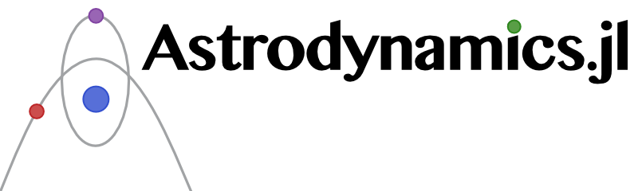

[](https://travis-ci.org/helgee/Astrodynamics.jl)
[](https://coveralls.io/github/helgee/Astrodynamics.jl?branch=master)
[](https://codecov.io/gh/helgee/Astrodynamics.jl)

Astrodynamics.jl is an MIT-licensed library for the development of astrodynamics software tools in Julia.

## Installation
The package is under heavy development and therefore not yet registered. Use the following command to clone the current master:

```julia
Pkg.clone("https://github.com/helgee/Astrodynamics.jl.git")
```
